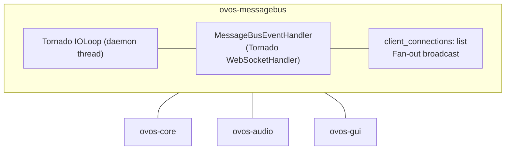
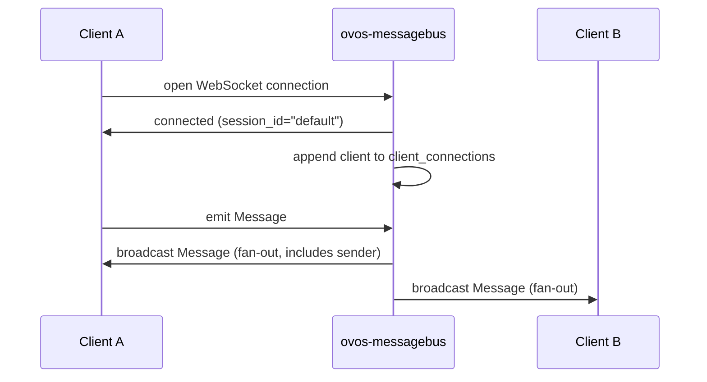

# Bus Service

!!! success "Maturity — Mature ⬤⬤⬤⬤⬤"
    Long-lived and actively maintained. Depend on it freely. Rated by [repository health](maturity.md), not version.

!!! abstract "In a nutshell"
    The messagebus is the shared channel that lets all the separate parts of OpenVoiceOS talk to one another. Picture a group radio frequency: whatever one part says is heard by everyone tuned in, and each part simply pays attention to the messages meant for it and ignores the rest. There's no traffic controller deciding who gets what. Every message goes to everybody. It's how the listener, the brain, the audio, and the screen all stay in sync. See the [Architecture Overview](architecture-overview.md) for how the pieces fit together, or the [Glossary](glossary.md) for unfamiliar terms.

??? info "📐 Formal specification"
    The `{type, data, context}` envelope, the `source`/`destination` routing keys, the `forward`/`reply`/`response` derivations, and the session carrier that rides in every message are all normative. See **[OVOS-MSG-1 — Bus Message](https://github.com/OpenVoiceOS/architecture/blob/dev/msg-1.md)**, **[OVOS-SESSION-1 — Session Carrier](https://github.com/OpenVoiceOS/architecture/blob/dev/session-1.md)**, **[OVOS-SESSION-2 — Session Lifecycle](https://github.com/OpenVoiceOS/architecture/blob/dev/session-2.md)**, and **[OVOS-BRIDGE-1 — Bus Bridge & Opaque Relay](https://github.com/OpenVoiceOS/architecture/blob/dev/bridge-1.md)** (how satellites relay messages across a [HiveMind](hivemind-agents.md) mesh), plus the [spec index](architecture-specs.md). This page describes the reference implementation. Where it diverges from the spec, the spec wins.

The **messagebus** is the central nervous system of the OVOS platform. All services communicate by publishing and subscribing to typed `Message` objects through this central WebSocket broker.

**In plain terms:** every OVOS service (core, audio, listener, GUI) connects to one shared WebSocket. Whatever any service emits, every other service receives. There is no central router deciding who gets what. Services just listen for the message types they care about and ignore the rest.

---

## Overview

`ovos-messagebus` is a pure fan-out WebSocket broker. Every message received from one client is broadcast verbatim to every connected client. The bus performs no filtering, routing, or transformation.



*Diagram: ovos-messagebus's Tornado IOLoop drives a MessageBusEventHandler that fans out messages via client_connections, with ovos-core, ovos-audio, and ovos-gui connected as example clients.*

The clients above connect via `ovos-bus-client`.

The broker itself has no logic beyond fan-out: it holds a list of open WebSocket connections and,
for every message any one client sends, writes that same message to every other open connection.
The Tornado I/O loop shown in the box runs this on its own daemon thread, so it does not block
whichever process embeds it.

`ovos-core`, `ovos-audio`, and `ovos-gui` above are just three
example clients. Anything speaking the same WebSocket protocol, including your own scripts, can
connect and take part with the same permissions as any other client.

The sequence below traces one client's connect handshake and one broadcast round-trip:



*Diagram: Client A opens a WebSocket connection and gets a connected reply, then emits a Message that the bus broadcasts back to Client A and out to Client B.*

---

## Running the Server

```bash
ovos-messagebus

# or
python -m ovos_messagebus

```

The server reads connection parameters from `mycroft.conf` (`websocket` section) and starts listening on a daemon thread. On SIGTERM/SIGINT the daemon thread exits with the main process. No explicit cleanup is required.

---

## Configuration

All settings live under the `websocket` key in `mycroft.conf`:

```json
{
  "websocket": {
    "host": "127.0.0.1",
    "port": 8181,
    "route": "/core",
    "ssl": false,
    "shared_connection": true,
    "max_msg_size": 25,
    "async_sender": false,
    "local_echo_topics": []
  }
}

```

| Key | Default | Description |
|---|---|---|
| `host` | `"127.0.0.1"` | Bind address. The shipped default restricts to localhost; set `"0.0.0.0"` to bind all interfaces. |
| `port` | `8181` | TCP port. The GUI service uses a separate port, `18181` by default (config key `gui_websocket.base_port`). |
| `route` | `"/core"` | WebSocket URL path. Full URL: `ws://host:port/core`. |
| `ssl` | `false` | Serve (and connect) over `wss://` instead of `ws://`. The Tornado `ovos-messagebus` terminates TLS itself — it uses `ssl_cert`/`ssl_key` if set, otherwise generates a self-signed pair on first start (needs the `ssl` extra). Clients (`ovos-bus-client`) build their URL from this same key. See the TLS note below; [HiveMind](hivemind-agents.md) is the other route to encrypted transport. |
| `shared_connection` | `true` | When `true`, all skills share ovos-core's single bus connection. Set `false` to give each skill its own connection (so one skill cannot manipulate another's bus traffic). |
| `async_sender` | `false` | Opt-in perf flag ([`ovos-bus-client#285`](https://github.com/OpenVoiceOS/ovos-bus-client/pull/285), not yet merged): move outbound socket writes onto one dedicated daemon thread reading a bounded queue, instead of every emitting thread serializing on the socket's send lock. Ordering is unchanged; a send error surfaces in the sender thread's log rather than the caller's. Also settable via the `OVOS_BUS_ASYNC_SENDER` env var. |
| `local_echo_topics` | `[]` | Opt-in perf flag ([`ovos-bus-client#292`](https://github.com/OpenVoiceOS/ovos-bus-client/pull/292), not yet merged): a list of message types that, in addition to going out on the wire as usual, are delivered to this same process's own listeners immediately rather than waiting for the round trip back over the socket. Meant for hot handler-ack paths within one process (e.g. an intent dispatcher waiting on a same-process skill's ack). Each local delivery still happens exactly once — the wire copy carries a per-client marker that the client's own `on_message` recognizes and drops. |
| `max_msg_size` | `25` | Max WebSocket frame size in megabytes. |

`filter` / `filter_logs` are also recognized (code-level defaults in the messagebus event
handler are `filter` off, `filter_logs` `["gui.status.request", "gui.page.upload"]`) but are not
part of the shipped `mycroft.conf` `websocket` section.

!!! danger "Security: the bus has no authentication, keep it local"
    The messagebus has **no authentication and no encryption**, and **any** client that can
    connect gets control of everything installed skills and plugins expose over the bus, up
    to root-level system control (reboot, shutdown, factory-reset) **if** an AdminPHAL system
    plugin such as `ovos-PHAL-plugin-system` is installed and enabled (see
    [phal.md](phal.md#security-model)). Treat it like an open door to the whole assistant.

    - **Keep it bound to localhost** (`host: "127.0.0.1"`, the shipped default). Only set
      `"0.0.0.0"` if you fully control the network, and **never port-forward 8181** to the
      internet.
    - For **remote access** (satellites, phones, other rooms), do not expose the bus. Use
      [HiveMind](hivemind-agents.md), which adds authentication and encryption on top.
    - This is also why the bus is a trust boundary: a malicious skill or plugin on the device
      already has full access, so only install software you trust.
    - **The GUI WebSocket needs the same treatment.** `ovos-gui` serves a second, equally
      unauthenticated socket on port `18181`, and messages received there are translated into
      emits on this bus, so it carries the same authority. Like the bus, it ships bound to
      `127.0.0.1`. Widening `gui_websocket.host` to `0.0.0.0` (required for a remote
      display) exposes that unauthenticated socket to the whole network. Keep the loopback
      default unless a remote display needs it, and re-check configs from older installs
      that may still carry a `0.0.0.0` value.

    See [Privacy & Security](privacy-security.md) for the full trust model.

---

## Implementation: `MessageBusEventHandler`

**Module:** `ovos_messagebus.event_handler.MessageBusEventHandler`, in [`ovos_messagebus/event_handler.py`](https://github.com/OpenVoiceOS/ovos-messagebus/blob/dev/ovos_messagebus/event_handler.py)

Tornado `WebSocketHandler` subclass implementing the OVOS messagebus. All connected clients share a single module-level connection list (`client_connections`).

### Broadcast Behavior

The bus is a pure fan-out: no routing, no filtering, no topic subscriptions at the server level. Every message every client sends is forwarded to every client (including the sender):

```python

# ovos_messagebus/event_handler.py — broadcast loop
for client in client_connections:
    client.write_message(message)

```

Subscription filtering is handled entirely in the client library (`ovos-bus-client`).

---

??? abstract "Technical Reference"

    - `main()`, in [`ovos_messagebus/__main__.py`](https://github.com/OpenVoiceOS/ovos-messagebus/blob/dev/ovos_messagebus/__main__.py): entry point initializing the Tornado application and IOLoop.


    - `MessageBusEventHandler.on_message()`, in [`ovos_messagebus/event_handler.py`](https://github.com/OpenVoiceOS/ovos-messagebus/blob/dev/ovos_messagebus/event_handler.py): core broadcast logic.


    - `load_message_bus_config()`, in [`ovos_messagebus/load_config.py`](https://github.com/OpenVoiceOS/ovos-messagebus/blob/dev/ovos_messagebus/load_config.py): configuration loader using `ovos-config`.
    
    ### `open()`
    
    Called when a new WebSocket connection is established. Writes a `connected` message (with `context.session.session_id = "default"`) to the new client only, then appends `self` to `client_connections`.
    
    ### `on_message(message)`
    
    Called for each incoming WebSocket frame. Broadcasts the raw message string to **all** connections. When `filter: true`, the message type, source, destination, and session are logged before broadcast.
    
    ### `check_origin(origin) → bool`
    
    Always returns `True`. OVOS does not enforce CORS/origin checks.
    
    ### `max_message_size`
    
    ```python
    config.get("websocket", {}).get("max_msg_size", 10) * 1024 * 1024
    ```
    
    The shipped `mycroft.conf` sets `max_msg_size` to 25, so the effective default is
    25 MB (the code's hardcoded fallback of 10 only applies if the key is absent).
    Tornado closes the connection when a message exceeds this size.
    
    ---
    

## Message Structure

Every message on the bus is a JSON object with three fields:

```json
{
  "type": "recognizer_loop:utterance",
  "data": {"utterances": ["what time is it"], "lang": "en-US"},
  "context": {"session": {"session_id": "default"}, "source": "listener"}
}

```

- `type`: identifies the event


- `data`: arbitrary JSON payload


- `context`: routing/session metadata

The bus recognises only one special message type: `connected` (emitted to a new client immediately after it opens a connection). All other types are application-level.

!!! note "Colon vs. dot: what a topic's shape tells you"
    A `:` in a topic's `type` marks it as **runtime-assembled dispatch**, built from identifiers to address a specific handler rather than broadcast. The canonical, most common shape is `<skill_id>:<intent_name>` (intent dispatch), but a few pipeline-internal topics also use the colon form, such as `<pipeline_id>:global_stop`, and the fixed-name `converse:skill` and `question:query` handlers. Note these are literal names, not `<skill_id>` templates. The per-skill dispatch they trigger is the dotted `{skill_id}.converse.request`. So a colon means "dispatch / pipeline-internal, addressed at runtime", not exclusively skill-intent. Everything else, including events, requests, responses, and lifecycle signals, uses the dotted `<x>.<y>.<verb>` form.

See [Bus Client](core-libraries.md#ovos-bus-client) for the `Message` Python API.

---

## Sessions

Every message may carry a `session` object inside its `context`. Sessions enable:

- Per-user conversational context


- Independent pipeline configuration per client


- Site/device identification (`site_id`)


- [Skill](skill-design-guidelines.md) and intent blacklisting per session

The default session (`session_id="default"`) is used by the local microphone. HiveMind satellites each have their own session.

A `session` that is entirely absent (or explicitly `null`) is normal. It just means "use the default session." A `session` key that is present but isn't a JSON object is a different case, a producer bug: the bus client discards that one message and logs a warning rather than raising, so a single malformed producer can't force every client on the bus into a reconnect loop.

See [Bus Session](session.md) for full `Session` and `SessionManager` documentation.

---

## Message Targeting and Routing

The bus itself performs no routing. Every client receives every message. However, `context["source"]` and `context["destination"]` allow applications (notably HiveMind) to implement their own routing logic.

The `Message` object provides the three derivations defined in [OVOS-MSG-1 §5](https://github.com/OpenVoiceOS/architecture/blob/dev/msg-1.md) (the spec mandates the resulting message *shape*, not the method names):

- `.reply(msg_type, data)`: swap `source`↔`destination`, preserving context (MSG-1 §5.2)


- `.forward(msg_type, data)`: copy context verbatim under a new type (MSG-1 §5.1)


- `.response(data)`: shorthand for `reply(self.msg_type + ".response", ...)` (MSG-1 §5.3)

There is **no** central correlation/in-reply-to mechanism. Messages are fully async and self-contained. An asker that wants to match a `.response` back to its request does so itself, keyed on the `session` (MSG-1 §5.4).

---

## Key Message Categories

### Core / Intent Pipeline

Topic names below are the canonical spec names ([OVOS-PIPELINE-1 §9](https://github.com/OpenVoiceOS/architecture/blob/dev/pipeline-1.md)). The legacy name is shown where current code still emits it. Both names are usable on the wire. See [Namespace migration](#namespace-migration) below for how `ovos-bus-client` bridges the two.

| Message type | Publisher | Consumers |
|---|---|---|
| `ovos.utterance.handle` (legacy: `recognizer_loop:utterance`) | `ovos-dinkum-listener` | the orchestrator (`ovos-core`) |
| `ovos.utterance.speak` (legacy: `speak`) | handler / skill | `ovos-audio` |
| `ovos.intent.unmatched` (legacy: `complete_intent_failure`) | the orchestrator | fallback handlers |
| `ovos.utterance.handled` | the orchestrator | GUI clients (universal end-marker, §9.5) |

### Skill Manager

| Message type | Publisher | Consumers |
|---|---|---|
| `mycroft.skills.initialized` | `ovos-core` | GUI clients, tools |
| `skillmanager.list` | * | `ovos-core` |
| `ovos.skills.install` | * | `ovos-core` |

### Session Sync

| Message type | Publisher | Consumers |
|---|---|---|
| `ovos.session.sync` | new client | `ovos-core` |
| `ovos.session.update_default` | `ovos-core` | all clients (legacy default-session echo, deprecated) |

### Connectivity / [PHAL](phal.md)

| Message type | Publisher | Consumers |
|---|---|---|
| `mycroft.network.connected` | `ovos-PHAL` | `ovos-core`, skills |
| `mycroft.internet.connected` | `ovos-PHAL` | `ovos-core`, skills |

---

## Namespace migration

`ovos-bus-client` bridges legacy and `ovos.*` spec topic names automatically, so producers and
consumers can each switch at their own pace. See
[Bus namespace migration](bus-namespace-migration.md) for the full mechanism, the on/off
switches, and the pending removal of the bridge.

---

## High-level API wrappers

`ovos-bus-client` ships four wrapper classes that give plugin and skill authors a typed method
call instead of hand-building `Message` objects for common subsystems: `GUIInterface`,
`OCPInterface`, `EnclosureAPI`, and `EventSchedulerInterface` (in `ovos_bus_client/apis/`). Skills
reach these through properties such as `self.gui`, `self.audio_service` (OCP), and
`self.event_scheduler` rather than importing the classes directly.

Most of their methods accept an optional `source_message` argument. Pass the `Message` that
triggered the call through so the outgoing message inherits its `session`. Skipping
`source_message` means the outgoing message has no session, which can cause OCP and the GUI to
act on the wrong device in a multi-user deployment (several satellites sharing one `ovos-core`
over HiveMind). Always pass it through when the wrapper call happens inside a handler that
received a message.

---

## Services That Connect to the Bus

| Service | Role |
|---|---|
| [ovos-core](core.md) | Intent pipeline, skill orchestration |
| ovos-audio | [TTS](tts-plugins.md) rendering and audio playback |
| ovos-gui | GUI namespace management |
| ovos-dinkum-listener | Wake-word detection and [STT](stt-plugins.md) transcription |
| ovos-PHAL | Hardware abstraction layer |

GUI clients connect to `ovos-gui`'s own WebSocket (`ws://localhost:18181/gui`), not directly to the messagebus.

---

## Bus restart / reconnect behavior

When `ovos-messagebus` restarts, every connected `MessageBusClient` detects the drop, backs off,
and reconnects on its own. Messages sent during the outage are lost, not queued. See
[Bus restart / reconnect behavior](bus-reconnect.md) for the full mechanics and for how to serve
the bus over TLS.

---

## Alternative Implementations

`ovos-messagebus` is the reference **Tornado**-based server and is all you need for a normal install (`pip install ovos-messagebus`). The Tornado backend is the default. Because the wire protocol is just JSON frames over a WebSocket, the server is interchangeable. Any process that fans messages out to all connected clients on the same route will work, and a drop-in replacement can be swapped in without touching clients. The RaspOVOS image, for example, ships a separate Rust reimplementation (`ovos_rust_messagebus`) as its default for performance. See [Production Operations](production-operations.md).

A separate, drop-in Rust implementation exists as its own project for deployments that want lower overhead:

- [OscillateLabsLLC/ovos-rust-messagebus](https://github.com/OscillateLabsLLC/ovos-rust-messagebus): speaks the same OVOS wire protocol. Build and run it in place of the Python server. See that project's README for build and configuration details.

**In plain terms:** on a stable install, run the default Python (Tornado) server. Only reach for the Rust build if profiling shows the bus is a bottleneck.

!!! info "Optional `webrockets` backend"
    `ovos-messagebus` also bundles an optional, higher-throughput **webrockets** backend
    (Python), installed as an extra and run in place of the Tornado server:

    ```bash
    pip install "ovos-messagebus[webrockets]"
    python -m ovos_messagebus.backends.webrockets_backend
    ```

    It is early/alpha and not the default: it does **not** terminate TLS and does not honour
    `websocket.max_msg_size` (it refuses to start when `websocket.ssl` is set), so serve
    `wss://` with the Tornado backend. The repo ships a benchmark (`benchmark/run_benchmark.py`,
    `--compare`) that pits Tornado, webrockets, and the Rust server against each other. Early
    numbers put webrockets ahead at higher concurrency. On a stable install, stay on the
    default Tornado server unless profiling shows the bus is a bottleneck.

    **Known limitations of webrockets today:** no TLS termination at all (see above).
    `max_msg_size` is silently ignored rather than enforced, so an oversized frame is not
    rejected the way it would be on the Tornado backend. It also does not implement the
    `MessageBusEventHandler.on()` emitter hook that the Tornado backend exposes for embedding
    custom server-side handlers. Treat webrockets as a throughput experiment, not a feature-equal
    drop-in, until these close.

---

## Filter / Debug Mode

Set `websocket.filter: true` in `mycroft.conf` to log all message types before broadcasting. This does not affect message delivery.

```text
DEBUG: <msg_type> source: [...] destination: [...]
       SESSION: {...}

```

Messages listed in `filter_logs` are excluded from the log to reduce noise (default: `["gui.status.request", "gui.page.upload"]`).

When `filter` is off (the default), the bus never deserializes messages. It emits and re-broadcasts the raw frame as-is. Deserialization only happens in `filter` mode for the log line. If a frame fails to deserialize there, only the per-message summary log line and the local re-emit are skipped (a "failed to deserialize" debug line appears instead). The raw frame is still broadcast to every client: deserialization failure never blocks fan-out.

---

## Bus recipes

For runnable patterns (connecting and waiting for a response, the `ovos-bus-client` CLI tools,
and watching live traffic with `ovos-busmon`), see [Bus recipes](bus-recipes.md).

---

Further reading: [protocol interoperability between OVOS and other assistant frameworks](https://blog.openvoiceos.org/posts/2025-10-24-protocol_interoperability).

---
**Read next:** [Security & Trust Model](security-model.md) · [Concepts Overview](concepts-overview.md)
**Related:** [Bus Events Reference](bus-events.md) · [Bus Session](session.md) · [ovos-core Overview](core.md) · [Configuration Overview](config.md)
