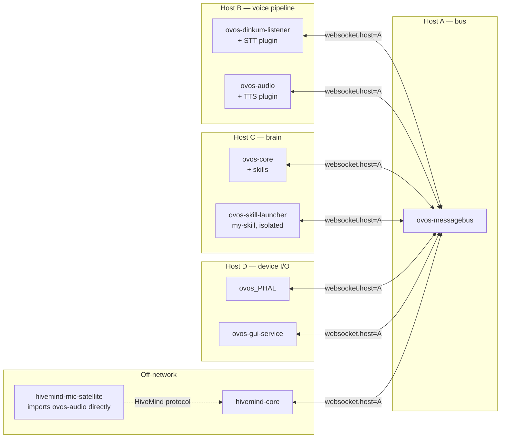

# Composable Deployments: OVOS as a Library

!!! abstract "In a nutshell"
    OVOS ships as a "batteries-included" assistant you can install with one command, but under
    the hood it is really a set of small, independent Python packages that happen to agree on a
    common protocol — the [messagebus](bus-service.md). Because of that, nothing forces you to run
    "all of OVOS" as one blob: you can start a single service on its own machine, load a single
    skill as its own process, or `pip install` a speech plugin into a completely unrelated Python
    project and call it directly, with no bus and no assistant around it at all. This page is
    about that second use case — OVOS the **library**, not OVOS the **product**.

## The principle

Every OVOS service — the bus, the voice pipeline, the audio player, the hardware abstraction
layer, the GUI — is an ordinary long-running Python process. They do not call each other's
functions or share memory; they exchange JSON [`Message`](bus-service.md) objects over a
WebSocket. Anything that can open that WebSocket and speak the same message types is a first-class
participant, whether it is `ovos-core` itself, a HiveMind satellite, a shell script, or a Node.js
prototype. This is what makes the two deployment styles below equally valid:

| Style | What you get | Typical use |
|---|---|---|
| **Batteries-included install** | `ovos-core` metapackage pulls in the bus, listener, audio, PHAL and GUI services and a process manager starts them all on one host | A voice appliance, [raspOVOS](install-raspovos.md), a desktop assistant |
| **À la carte library use** | You install and import only the pieces you need — one service, one skill, or a single plugin as a bare Python object | Distributed/embedded deployments, custom apps, testing one component in isolation |

Nothing in the code enforces the first style; it is a packaging convenience (`ovos-core` is a
metapackage), not an architectural requirement. The [Architecture Overview](architecture-overview.md)
covers how these services cooperate at runtime; this page covers how to run them apart.

## The standard split: one console script per service

Each core service is its own PyPI package with its own console-script entry point. Installing a
package makes the script available on `PATH`; running it starts that one process and nothing else.

| Service | Package | Console script | Role |
|---|---|---|---|
| messagebus | `ovos-messagebus` | `ovos-messagebus` | The WebSocket hub every other process connects to |
| Core / orchestrator | `ovos-core` | `ovos-core` | Pipeline matching, skill loading, intent dispatch |
| Voice pipeline | `ovos-dinkum-listener` | `ovos-dinkum-listener` | Wake word, VAD, STT, produces `recognizer_loop:utterance` |
| Audio playback | `ovos-audio` | `ovos-audio` | TTS synthesis and playback, `speak` handling |
| Hardware abstraction | `ovos-PHAL` | `ovos_PHAL` (underscore) | Battery, network, LEDs, and other device-specific integrations |
| PHAL admin actions | `ovos-PHAL` | `ovos_PHAL_admin` | Privileged system actions (shutdown/reboot) run as a separate process |
| GUI protocol server | `ovos-gui` | `ovos-gui-service` | Serves the [GUI protocol](gui-protocol.md) to display clients |
| Standalone intent matching | `ovos-core` | `ovos-intent-service` | Pipeline matching without the rest of core's skill orchestration |
| Standalone skill installer | `ovos-core` | `ovos-skill-installer` | Installs skills without a running `ovos-core` |

!!! note "Names are exact"
    The console scripts are not all named consistently with their package — notably `ovos-PHAL`
    installs `ovos_PHAL` and `ovos_PHAL_admin` with underscores, and the GUI service script is
    `ovos-gui-service`, not `ovos-gui`. Check `pip show -f <package>` if a script is not found.

### Pointing services at a shared bus

Every process reads the `websocket` block from its own [configuration](config.md) to find the
bus:

```jsonc
{
  "websocket": {
    "host": "127.0.0.1",   // change to the bus host's LAN address/hostname
    "port": 8181,
    "route": "/core",
    "ssl": false
  }
}
```

The default is `127.0.0.1` — **every service assumes the bus is local unless you say otherwise**.
To split services across hosts or containers, run `ovos-messagebus` on one host, then set
`websocket.host` to that host's address in the configuration of every other service. No other
wiring is needed: a listener on one machine, `ovos-core` on a second, and `ovos-audio` on a third
will cooperate exactly as if they were on the same box, as long as each can reach the bus's
`host:port`. The [GUI service](gui-service.md) has its own analogous `gui_websocket` block, since
display clients connect over a second WebSocket.

!!! warning "Localhost by default, everywhere"
    `websocket.host` (bus), `gui_websocket.host` (GUI protocol, default `0.0.0.0`, still same-host
    unless routed), and most PHAL plugin bindings default to loopback or same-host assumptions.
    Distributing services is supported but is a deliberate config change, not the out-of-the-box
    behavior — see [Caveats](#caveats) below.

## Standalone skills

A skill does not need a running `ovos-core` to execute — `ovos-workshop` ships a launcher that
loads exactly one skill and connects it to a bus on its own:

```bash
ovos-skill-launcher {skill_id} [path/to/skill/directory]
```

This is the `ovos-skill-launcher` console script, backed by `ovos_workshop.skill_launcher.SkillContainer`.
If you omit the directory it searches the standard skill directories for a folder matching
`skill_id`; if you pass one explicitly it loads from there, which is convenient for developing a
skill straight out of a git checkout.

```python
from ovos_workshop.skill_launcher import SkillContainer

skill = SkillContainer(skill_id="my-skill.openvoiceos", skill_directory="./my-skill")
skill.run()  # connects to the bus (websocket config) and loads only this skill
```

Because this is a normal Python process that only needs a reachable bus, it enables:

- **Developing one skill against a remote device** — run the skill on a laptop, point its
  `websocket.host` at a Raspberry Pi running the rest of the stack, and iterate without touching
  the device.
- **Resource isolation** — a heavyweight skill (e.g. one embedding a local LLM) runs in its own
  process with its own memory ceiling, instead of sharing `ovos-core`'s process.
- **Per-skill containers** — package a single skill and `ovos-skill-launcher` into a minimal
  container image, so a skill can be deployed, scaled, or restarted independently of the rest of
  the assistant.

## Library reuse outside OVOS

The pattern goes further than "one service, one process" — the packages underneath each service
are ordinary importable libraries with no hard dependency on a bus being present.

**HiveMind satellites import audio/listener internals directly.** `hivemind-mic-satellite` (a
[HiveMind](hivemind-agents.md) client, not an OVOS-org package) depends on `ovos-audio` and
`ovos-plugin-manager` and imports their classes directly instead of talking to a running
`ovos-audio` process:

```python
from ovos_audio.audio import AudioService
from ovos_audio.playback import PlaybackThread
from ovos_plugin_manager.microphone import OVOSMicrophoneFactory, Microphone
from ovos_plugin_manager.vad import OVOSVADFactory, VADEngine
from ovos_PHAL.service import PHAL
```

It reuses the audio-playback and microphone/VAD machinery as plain Python classes inside its own
process, then relays results to the hive over its own protocol — no `ovos-audio` process is ever
started.

**OPM plugins run as plain libraries, with no bus at all.** The OpenVoiceOS Plugin Manager
(`ovos-plugin-manager`, "OPM") factories construct STT/TTS/VAD engines from configuration; nothing
about the returned object requires a bus:

```python
from ovos_plugin_manager.vad import OVOSVADFactory
import numpy as np

vad = OVOSVADFactory.create({"module": "ovos-vad-plugin-noise"})
audio = (np.random.rand(1600) * 100).astype("int16").tobytes()
vad.is_silence(audio)  # -> False, plain function call, no messagebus involved
```

The same applies to `OVOSSTTFactory.create(config)` and `OVOSTTSFactory.create(config)` — both
return an engine object you call directly (`.execute(audio)`, `.get_tts(text, path)`) in a script,
a notebook, or a completely unrelated application that has nothing to do with voice assistants.

**`ovos-bus-client` and `ovos-utils` are building blocks in their own right.** `ovos-bus-client`
supplies `MessageBusClient`/`Message` (and the `ovos-listen`/`ovos-speak`/`ovos-say-to` CLI tools,
see [CLI Tools](cli-tools.md)) for anything that wants to talk *to* an existing OVOS bus without
being a skill or a service. `ovos-utils` supplies logging, audio I/O helpers, and — notably —
`ovos_utils.fakebus.FakeBus`, an in-memory stand-in used to exercise skill/plugin code in tests
without any network socket at all. See [Core Libraries](core-libraries.md) for the full map of
these packages and their upstream docs.

## Containers: one service per box

[`ovos-docker`](https://github.com/OpenVoiceOS/ovos-docker) mirrors the same split at the
container level: it ships one Dockerfile/image per service (`messagebus`, `core`, `listener`,
`audio`, `phal`, `phal-admin`, `gui`, `gui-websocket`, `skills`) plus compose files that wire them
together over a shared network. Because each image only installs the one service's package, they
can be scheduled independently — scaled, restarted, or placed on different hosts — as long as
`websocket.host` in each container's configuration resolves to the bus container.

The same idea shows up as standalone servers for individual speech components, packaged as their
own containers/services rather than as OVOS services at all:

| Server | What it exposes |
|---|---|
| `ovos-stt-server` | An HTTP/WebSocket wrapper around an STT plugin — POST audio, get text back |
| `ovos-tts-server` | An HTTP wrapper around a TTS plugin — POST text, get audio back |
| `ovos-translate-server` | An HTTP wrapper around a machine-translation plugin |

These have no bus dependency and no notion of "skills" or "sessions" — they are thin HTTP
front-ends over the same OPM factories shown above, useful when another application (OVOS or not)
just needs a speech primitive over the network.

## Example topology



## Caveats

Splitting services this way is fully supported, but it moves responsibilities that a single-host
install hides for you. These are the most common sources of confusion.

### Plugins must be installed where they load

A plugin is only usable by the process that imports it. Installing an STT plugin next to
`ovos-core` does nothing if it is `ovos-dinkum-listener` that needs it.

| Plugin type | Loaded by | Must be installed in |
|---|---|---|
| STT | `ovos-dinkum-listener` | The listener's environment/container |
| TTS | `ovos-audio` | The audio service's environment/container |
| VAD, wake word, microphone | `ovos-dinkum-listener` | The listener's environment/container |
| Pipeline (intent matching), skills | `ovos-core` | The core's environment/container |
| PHAL plugins | `ovos_PHAL` | The PHAL service's environment/container |
| GUI adapters | `ovos-gui-service` | The GUI service's environment/container |

There is no cross-process plugin discovery — each service resolves plugins from its **own**
Python environment's entry points at startup.

### Configuration is per-process, not shared

Each process reads its own `mycroft.conf` from its own [XDG config path](config.md)
(`$XDG_CONFIG_HOME/mycroft` — inside a container that is the container's filesystem, not the
host's). Splitting services means keeping the relevant keys **consistent by hand** across every
process's configuration — a `websocket.host` mismatch, or a listener that doesn't know which STT
module `ovos-core` expects it to have already run, will silently misbehave rather than error
loudly.

### Version skew is a real risk

Every process talks over the same bus protocol independently — there is no central version
negotiation. Mismatched major versions across `ovos-bus-client`, `ovos-core`, `ovos-audio`, and
`ovos-dinkum-listener` can produce message shapes one side doesn't expect. Keep versions aligned
across a deployment, and check each package's changelog before upgrading only one service.

### Latency and network reality

A single-host install exchanges messages over loopback, effectively free. Splitting services
across hosts puts real network latency and reliability on the critical path of every utterance —
wake word detection, STT, intent matching, and TTS all round-trip through the bus. A slow or
lossy link between the listener and the bus is felt as sluggish or dropped voice interactions, not
as an error message.

### Defaults assume localhost

`websocket.host` (`127.0.0.1`), and most PHAL device-integration plugins, assume everything they
talk to is on the same machine. Treat every default as loopback-only until you have explicitly
verified the config for a given deployment — the services will start and look healthy on separate
hosts with the defaults untouched, they simply will not be able to reach each other.

## See also

- [Architecture Overview](architecture-overview.md) — how the services cooperate on a single host
- [Bus Service](bus-service.md) — the protocol all of this rests on
- [Core Libraries](core-libraries.md) — what each shared package provides
- [Config](config.md) — how configuration files are located and merged
- [Remote Agents with HiveMind](hivemind-agents.md) — a concrete distributed deployment built on these building blocks
- [Install raspOVOS](install-raspovos.md) — the batteries-included counterpart
