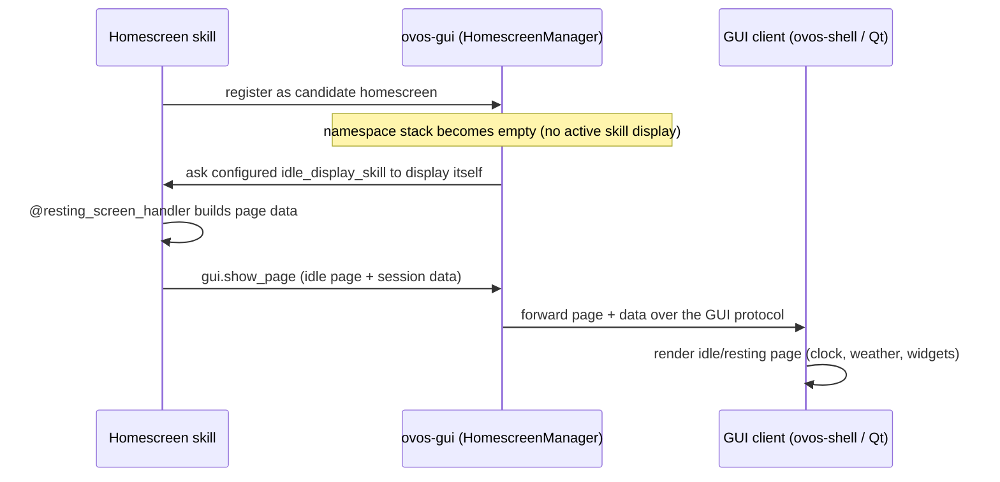

# OpenVoiceOS Home Screen

!!! abstract "In a nutshell"
    The home screen (or "resting screen") is what a device with a display shows when it is just sitting idle — typically the clock, date, weather, and small widgets, much like a smart speaker's standby face. When nothing else is being shown, OVOS falls back to this screen. Note that this page covers the **legacy** screen stack, which is deprecated today and mainly relevant to **Mark 2** devices; in the upcoming rework the home screen becomes a job for the display backend rather than a skill. See the [Glossary](glossary.md) for terms.

!!! danger "The OVOS GUI is deprecated — see [Screens on OVOS Today](gui-status.md) for the full picture"
    The home screen is part of the legacy stack. There is no generally usable OVOS GUI right
    now, and a replacement is **Upcoming**.

The home screen is what a device with a display shows when it is idle — clock, date,
weather, widgets, and so on. It is an ordinary **skill** that registers a *resting screen*;
when the [GUI](gui-service.md) namespace stack is empty, the configured homescreen skill is
asked to display its idle page.

On the current (legacy) stack, `ovos-gui` tracks the configured homescreen via its
`HomescreenManager` (`ovos_gui/homescreen.py`). Today that manager only handles **skill
selection and lifecycle** — which homescreen skill is active, registering/removing candidate
homescreens, and asking the active one to display itself (`homescreen.manager.*` messages). It
does **not** push clock/weather/widget data over the bus; a homescreen skill fetches or computes
whatever data it wants to show on its own.

## End-to-end resting-screen flow



## Configuration

Select a homescreen skill in `mycroft.conf` (or via [ovos-shell](ovos-shell.md)):

```json
{
  "gui": {
    "idle_display_skill": "skill-ovos-homescreen.openvoiceos"
  }
}

```

!!! warning "Upcoming — live homescreen-data bus messages"
    The `homescreen.data.*` / `homescreen.widget.*` messages below **do not exist on the
    current (legacy) stack**. They are implemented in the **not-yet-released**
    `ovos-legacy-mycroft-gui-plugin` (`ovos_legacy_mycroft_gui/homescreen.py`), the
    [GUI-adapter](gui-adapters.md) that takes over homescreen data/widget coordination in the
    rework — so a display can render a live idle screen without depending on a skill polling
    its own data. They are documented here as a preview of that plugin's contract.

    ### `homescreen.data.*`

    | Message | Emitted | Payload |
    |---|---|---|
    | `homescreen.data.time` | every **10 s** (via `ovos_date_parser.get_date_strings()`) | `time_string`, `date_string`, `weekday_string`, `day_string`, `month_string`, `year_string` |
    | `homescreen.data.weather` | every **900 s** (requested from the weather skill) | `weather_api_enabled`, `weather_code`, `weather_temp` |
    | `homescreen.data.wallpaper` | on `homescreen.wallpaper.set` (PHAL wallpaper manager) | `wallpaper_path`, `selected_wallpaper` |
    | `homescreen.data.notifications` | on `ovos.notification.update_counter` / `ovos.notification.update_storage_model` | `notification_counter`, `notification_model` |
    | `homescreen.data.apps` | when a skill registers/unregisters an app | `applications_model` |
    | `homescreen.data.examples` | on example registration, on `detach_skill`, and every **900 s** to rotate the list | `skill_examples`, `skill_info_enabled`, `skill_info_prefix` |
    | `homescreen.data.connectivity` | on connectivity changes | `system_connectivity` (`"online"`, `"network"`, `"offline"`) |

    ### `homescreen.widget.*`

    | Message | Emitted |
    |---|---|
    | `homescreen.widget.timer` | on `ovos.widgets.timer.update` / `.display` / `.remove` |
    | `homescreen.widget.alarm` | on `ovos.widgets.alarm.update` / `.display` / `.remove` |
    | `homescreen.widget.media` | on OCP player state changes (`gui.player.media.service.sync.status`) and track info responses |

    ### Consumed registration / lifecycle events

    | Message | Action |
    |---|---|
    | `homescreen.register.app` | Store the app entry, re-emit `homescreen.data.apps` |
    | `homescreen.register.examples` | Store examples per skill/lang, re-emit `homescreen.data.examples` |
    | `detach_skill` | Remove the skill from apps + examples, re-emit the affected messages |
    | `mycroft.ready` | Re-push all cached state (apps, connectivity, wallpaper, notifications) |

## Resting Faces

!!! warning "Upcoming — the skill-side resting-screen API is being removed"
    Per OVOS-GUI-1 §6.9, the home/resting screen is a **render-backend concern, not a skill
    concern** — applications must not register a home or resting screen. The skill-side API
    below (`@resting_screen_handler`, `homescreen_app`, and the `IdleDisplaySkill` base class)
    is therefore being **removed** from `ovos-workshop` (a planned breaking change). The resting
    display moves into the [GUI plugin / render backend](gui-adapters.md). This still works on
    current releases; it is documented here for existing skills.

The resting face API provides skill authors the ability to extend their skills to supply their own customized IDLE screens that will be displayed when there is no activity on the screen.

```python
import requests
from ovos_workshop.skills import OVOSSkill
from ovos_workshop.decorators import intent_handler, resting_screen_handler


class CatSkill(OVOSSkill):
    def update_cat(self):
        r = requests.get('https://api.thecatapi.com/v1/images/search')
        return r.json()[0]['url']

    @resting_screen_handler("Cat Image")
    def idle(self, message):
        img = self.update_cat()
        self.gui.show_image(img)

    @intent_handler('show_cat.intent')
    def cat_handler(self, message):
        img = self.update_cat()
        self.gui.show_image(img)
        self.speak_dialog('mjau')

```

A more advanced example, refreshing a webpage on a timer

```python
from ovos_workshop.skills import OVOSSkill
from ovos_workshop.decorators import intent_handler, resting_screen_handler

class WebpageHomescreen(OVOSSkill):

    def initialize(self):
        """Perform final setup of Skill."""
        # Disable manual refresh until this Homepage is made active.
        self.is_active = False
        self.disable_intent("refresh-homepage.intent")
        self.settings_change_callback = self.refresh_homescreen

    def get_intro_message(self):
        """Provide instructions on first install."""
        self.speak_dialog("setting-url")
        self.speak_dialog("selecting-homescreen")

    @resting_screen_handler("Webpage Homescreen")
    def handle_request_to_use_homescreen(self, message: Message):
        """Handler for requests from GUI to use this Homescreen."""
        self.is_active = True
        self.display_homescreen()
        self.refresh_homescreen(message)
        self.enable_intent("refresh-homepage.intent")

    def display_homescreen(self):
        """Display the selected webpage as the Homescreen."""
        default_url = "https://openvoiceos.github.io/status"
        url = self.settings.get("homepage_url", default_url)
        self.gui.show_url(url)

    @intent_handler("refresh-homepage.intent")
    def refresh_homescreen(self, message: Message):
        """Update refresh rate of homescreen and refresh screen.

        Defaults to 600 seconds / 10 minutes.
        """
        self.cancel_scheduled_event("refresh-webpage-homescreen")
        if self.is_active:
            self.schedule_repeating_event(
                self.display_homescreen,
                0,
                self.settings.get("refresh_frequency", 600),
                name="refresh-webpage-homescreen",
            )

    def shutdown(self):
        """Actions to perform when Skill is shutting down."""
        self.is_active = False
        self.cancel_all_repeating_events()

```
