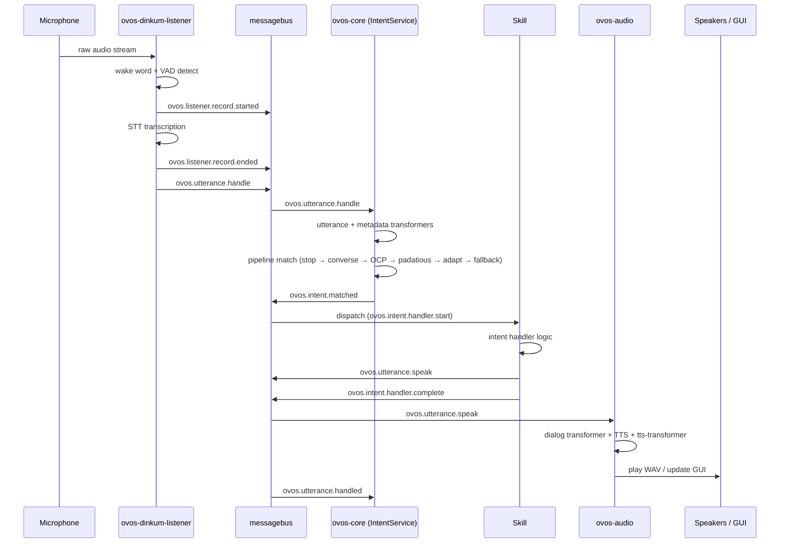

# The Life of an Utterance

!!! abstract "In a nutshell"
    This page follows a single spoken utterance on its whole journey through OpenVoiceOS — from the instant sound reaches the microphone to the moment you hear a reply. Along the way the system notices the wake word, records what you say, turns it into text, works out what you meant, does the task, and speaks back. It's a guided tour of the assembly line that handles everything you say to it. New to the terms here? Start with the [Glossary](glossary.md), or see the [Architecture Overview](architecture-overview.md) for the bigger picture.

??? info "📐 Formal specification"
    This whole journey is specified end-to-end: audio capture → STT → utterance by **[OVOS-AUDIO-IN-1 — Audio Input Service](https://github.com/OpenVoiceOS/architecture/blob/dev/audio-in.md)**; the utterance lifecycle, matching, and dispatch by **[OVOS-PIPELINE-1 — Utterance Lifecycle & Pipeline](https://github.com/OpenVoiceOS/architecture/blob/dev/pipeline-1.md)**; the enrichment/rewrite points along the way by **[OVOS-TRANSFORM-1 — Transformer Plugins](https://github.com/OpenVoiceOS/architecture/blob/dev/transformer.md)**; and dialog → TTS → playback by **[OVOS-AUDIO-1 — Audio Output Service](https://github.com/OpenVoiceOS/architecture/blob/dev/audio-out.md)**. See also the [spec index](architecture-specs.md). Spec topic names are canonical below; the legacy name is noted once where current code still emits it.

This guide provides a technical, step-by-step walkthrough of how an utterance is processed by OpenVoiceOS, from the moment sound hits the microphone to the final spoken response.

The sequence diagram below traces the same eight stages across the services and bus events involved:

---

## 1. Capture and [Wake Word](wake-word-plugins.md) Detection
**Service:** `ovos-dinkum-listener` (or similar)
**Input:** Raw audio from the microphone plugin.

The listener service is always active, monitoring a stream of audio.

-   **[VAD](vad-plugins.md) Plugin**: Continuously checks if someone is speaking.

-   **Wake Word Plugin**: Monitors the audio stream for the configured wake word (e.g., "Hey Mycroft").

-   **Trigger**: Once the wake word is detected, the listener begins recording the subsequent audio as a potential utterance.

---

## 2. [Speech-to-Text](stt-plugins.md) ([STT](stt-plugins.md))
**Service:** `ovos-dinkum-listener`
**Output:** `ovos.utterance.handle` (legacy: `recognizer_loop:utterance`) ([messagebus](bus-service.md))

Once the user stops speaking (detected by the VAD plugin), the recorded audio buffer is sent to the **STT Plugin**. Capture is bracketed by the listening-lifecycle signals `ovos.listener.record.started` / `ovos.listener.record.ended` (OVOS-AUDIO-IN-1 §6; legacy: `recognizer_loop:record_begin` / `record_end`).

-   The STT engine (e.g., Whisper, Google, Vosk) transcribes the audio into text. Before STT, the raw audio first passes through the **audio-transformer chain** (OVOS-TRANSFORM-1 §3.1).

-   The listener emits an `ovos.utterance.handle` message — the lifecycle entry point of [OVOS-PIPELINE-1 §9.1](https://github.com/OpenVoiceOS/architecture/blob/dev/pipeline-1.md) — containing the transcription candidates in `data.utterances`.

---

## 3. Utterance and Metadata Transformation
**Service:** `ovos-core` ([Intent Service](intent-service.md)) — the **orchestrator**
**Bus Event:** `ovos.utterance.handle` (legacy: `recognizer_loop:utterance`)

The `IntentService` within `ovos-core` picks up the transcription. Before matching it to an intent, it passes it through two of the six [Transformer](transformer-plugins.md) chains ([OVOS-TRANSFORM-1](https://github.com/OpenVoiceOS/architecture/blob/dev/transformer.md)):

-   **Utterance Transformers** (§3.2): These can normalize the text (e.g., "42" -> "forty-two"), fix common STT errors, or expand abbreviations.

-   **Metadata Transformers** (§3.3): These can enrich the message context with information like the user's emotion or the current environmental noise level.

If the entry message carried no authoritative `lang` (the producer did not know the content language for certain — a common case for STT output), the orchestrator resolves the utterance's language **once**, from session evidence (user preference, lang-detect signals), and passes that resolved tag to every pipeline plugin's `match` call for this utterance. Pipeline plugins may refine the tag they receive (a multilingual matcher may detect a different content language) but must not re-derive it independently from session evidence — a single resolution point keeps the whole match round matching in the same language, rather than leaving the outcome to an accident of pipeline ordering.

---

## 4. Intent Pipeline Matching
**Service:** `ovos-core` (Intent Service)
**Process:** Ordered evaluation of matchers.

The (potentially modified) utterance is now evaluated against the **Intent Pipeline**. The orchestrator calls each pipeline plugin's `match(utterances, lang, session)` in order and takes the **first** that returns a `Match` — **first-match-wins**, with no cross-plugin confidence scoring (OVOS-PIPELINE-1 §6.2). The pipeline is **configurable**; the default order runs roughly as follows. A single matcher (e.g. Adapt, Padatious) is often registered several times at decreasing internal-confidence tiers (high → medium → low), which is why those names appear interleaved through the list:

1.  **[Stop](stop-pipeline.md)**: "stop" / "cancel" is checked first so the assistant can always be interrupted.

2.  **[Converse](converse-pipeline.md)**: Active skills are given a chance to intercept the utterance (e.g., for multi-turn questions).

3.  **[Common Play](ocp-pipeline.md) ([OCP](ocp-pipeline.md))**: If the utterance sounds like a media request (e.g., "Play some jazz"), it's routed to OCP.

4.  **[Padatious](padatious-pipeline.md)**: Example-based matching for natural-language phrasings.

5.  **[Adapt](adapt-pipeline.md)**: Keyword/rule matching for direct commands.

6.  **[Fallback](fallback-pipeline.md)**: As a last resort, fallback skills (like LLM-based solvers) attempt to handle the utterance.

(Other matchers such as [Model2Vec](m2v-pipeline.md) and, if installed, [Common Query](cq-pipeline.md) for general-knowledge questions, slot into this order too — see [Pipelines](pipelines-overview.md) for the full default and how to customize it.)

Each `match` call is bounded by a deployment-defined timeout — the recommended default is 10 seconds — so a hung or slow plugin cannot stall the whole pipeline forever; if a plugin overruns the bound, the orchestrator treats it as if it had raised an exception and moves on to the next matcher. When a bound is applied it is set at least as large as any collection window a stage runs internally (for example, a Common Query-style plugin that waits to gather candidate answers), since a shorter match-phase timeout would kill that stage mid-collection on every utterance. The orchestrator's bus loop stays live through the whole match phase too — it keeps servicing subscriptions, including poll replies destined for an in-flight plugin, so a matcher whose strategy involves a bus round-trip (a stop plugin gathering pongs, a converse or fallback poll) is not starved while another plugin's `match` call is still pending.

---

## 5. [Skill](skill-design-guidelines.md) Execution
**Service:** A specific Skill (running in `ovos-core`)
**Bus Event:** `ovos.intent.matched`, `{skill_id}.activate`, and the specific intent dispatch message.

Once a match is found, the orchestrator post-processes it through the **intent-transformer chain** (OVOS-TRANSFORM-1 §3.4), emits `ovos.intent.matched` (§9.2), then dispatches to the winning skill — the winning skill wraps its own handler in the **handler-lifecycle trio** `ovos.intent.handler.start` → `…complete` / `…error` (§8; legacy: `mycroft.skill.handler.*`) — these are emitted by the skill (via `ovos-workshop`'s handler wrapper), not the orchestrator. See [Intent Service](intent-service.md) for the exact mechanism.

A handful of intent names are **reserved**: a `Match` bearing one of them is a continuation or termination of an already-active skill's participation, not a fresh activation, so the dispatch does not push the skill onto `session.active_handlers` again. That suppression is keyed on the Match's reserved `intent_name` itself — never on which pipeline plugin produced the match — so the same reserved name behaves identically regardless of where in the pipeline it was matched.

-   The skill's **intent handler** is triggered.

-   The skill performs its logic (e.g., querying an API, controlling a device).

-   If the skill needs to respond, it calls `self.speak()` or `self.speak_dialog()`.

---

## 6. [Text-to-Speech](tts-plugins.md) ([TTS](tts-plugins.md))
**Service:** `ovos-audio`
**Bus Event:** `ovos.utterance.speak` (legacy: `speak`)

The skill emits an `ovos.utterance.speak` message containing the response text — the natural-language response exit point of the lifecycle (OVOS-PIPELINE-1 §9.6).

-   The `ovos-audio` service receives the message and runs the text through the **dialog-transformer chain** (OVOS-TRANSFORM-1 §3.5) before synthesis.

-   It sends the (transformed) text to the **TTS Plugin** (e.g., Piper, Mimic, Coqui) to generate a WAV file, then runs the audio through the **tts-transformer chain** (OVOS-TRANSFORM-1 §3.6). This dialog → TTS → tts-transformer → playback path is specified by [OVOS-AUDIO-1](https://github.com/OpenVoiceOS/architecture/blob/dev/audio-out.md).

-   It also requests **Visemes** (for lip-sync) from a **G2P Plugin**.

---

## 7. Audio Playback and GUI Updates
**Service:** `ovos-audio` and `ovos-gui`
**Output:** Sound from speakers and visuals on screen.

-   **Playback**: `ovos-audio` plays the generated WAV file through the configured audio output (e.g., ALSA, PulseAudio).

-   **GUI**: If the skill provided a UI (via `self.gui.show_page()`), the `ovos-gui` service renders the [QML](qt5-gui.md)/HTML view on the screen, often synchronized with the spoken response. ⚠️ The current ("legacy") [GUI](gui-service.md) is **deprecated** — there is no generally usable OVOS GUI right now (a replacement is in progress); the spoken response still works regardless.

---

## 8. [Session](session.md) Wrap-up
**Service:** `ovos-core` (Session Manager)

The lifecycle closes with exactly one `ovos.utterance.handled` event (OVOS-PIPELINE-1 §9.5) — the universal end-marker that fires whether an intent matched, a fallback answered, or nothing claimed the utterance. The conversation state is then updated: `turns_remaining` decrements after the match round regardless of whether anything matched, though entries freshly written this round are exempt from that decrement. If the skill requested a follow-up question (e.g., `expect_response=True`), the listener is reactivated immediately, and the cycle begins again at Step 1, but with the current **Session** context preserved.

---

## Further reading

- [Pipelines Overview](pipelines-overview.md) — the full default pipeline order and how to customize it.
- [Formal Specifications](architecture-specs.md) — the OVOS-PIPELINE-1, OVOS-TRANSFORM-1, and companion specs cited throughout this page.
- [Voice-first](https://blog.openvoiceos.org/posts/2026-01-25-voice-first) — why the assistant's design centers this same utterance journey.
